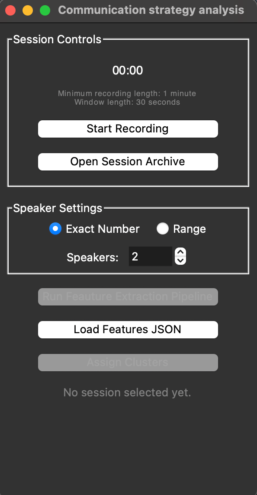

# Communication Analysis Pipeline For EDMO Sessions

This repository hosts the Communication Analysis Pipeline for EDMO (Educational Modular Robots) sessions. It is designed to assist teachers in understanding their students' learning and communication patterns better.

## Project Overview

The pipeline processes multimodal data from educational sessions, including:
- **Audio recordings** of student interactions.
- **Robot logs** detailing interactions with the EDMO robots.
- **Robot videos** (if available).

### Key Features
- **Feature Extraction**: Extracts relevant behavioral and interaction features from audio and robot logs.
- **Communication Strategy Identification**: Uses a pretrained clustering model to analyze data in 30-second time windows.
- **Strategy Classification**: Determines the specific communication strategy employed by students during each interval.

## Main Entry Point

The primary interface for this tool is the **Session Analysis UI**.

**File:** `alt_pipeline/session_analysis_ui.py`

To launch the application:
```bash
python alt_pipeline/session_analysis_ui.py
```

## User Interface

The UI provides a centralized hub for recording, managing, and analyzing session data.



### Functionalities

1.  **Session Controls**:
    *   **Recording**: Start and stop audio recording directly within the tool. Includes a timer and ensures a minimum recording length (1 minute).
    *   **Speaker Settings**: Configure the expected number of speakers (students). You can specify an **Exact Number** or a **Range** (Min/Max) to optimize the diarization process.

2.  **Session Management**:
    *   **Open Audio File**: Import an individual audio file (wav, mp3, m4a, etc.) to start a new analysis session. The tool automatically creates a new session structure for the imported file.
    *   **Open Session Archive**: Load and process previously recorded session folders.
    *   **Load Features JSON**: Directly load a pre-existing features JSON file to skip the extraction step and proceed to analysis.

3.  **Analysis Workflow**:
    *   **Run Feature Extraction Pipeline**: Executes the core processing pipeline (`alt_pipeline/pipeline.py`) on the current session. It extracts audio and robot features based on the configured speaker settings.
    *   **Assign Clusters**: This step uses the extracted features to classify communication strategies.
        *   **Smart Detection**: Automatically detects if the data is audio-only or includes robot interaction features.
        *   **Visual Analysis**: Loads the appropriate pretrained cluster model (`voice` or `robot`) and generates plots visualizing the communication dynamics over the session.

## Installation

Ensure you have the necessary dependencies installed:

```bash
pip install -r requirements.txt
```

## Configuration

This project uses the `pyannote/speaker-diarization-community-1` model for speaker diarization. To access it, you need to set up a Hugging Face token.

1.  **Get a Token**: Create a User Access Token in your [Hugging Face settings](https://huggingface.co/settings/tokens).
2.  **Setup Environment**: Create a `.env` file in the project root and add the token:
    ```bash
    HF_TOKEN=your_hugging_face_token_here
    ```

## Structure
- `alt_pipeline/`: Contains the main analysis logic, UI, and clustering scripts.
- `src/`: Contains core services for audio processing, NLP, and robot data handling.
- `Cluster-Analysis/`: Scripts for examining and loading cluster models.

## AI Assistance
GitHub Copilot was used to assist with syntax generation and boilerplate code, but the core algorithmic logic and system design are our own original work (wherever it is not mentioned otherwise).
